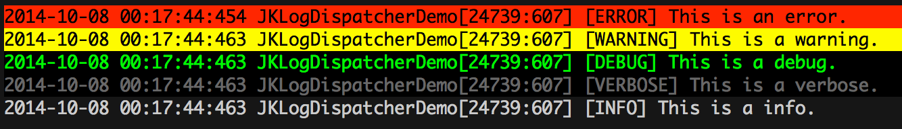

JKLoggerDispatcher
==================

Check the swift version here ☞  [LogDispatcher.Swift](https://github.com/YuAo/LogDispatcher.Swift)

##Overview
When you call NSLog() to print/log something, JKLogDispatcher will walk through a list of registered log processing modules, choose the proper one, and use it to do some additional processing for the log.

##Why overload NSLog()?

**The answer is we want to keep the code clean and no redundancy.**

Rememeber how you add analytics code to your project? 

Let say you need to track how many times the button user have tapped. you add a method responsding to UIButton's UIControlEventTouchUpInside event, and write the analytic code straighthod in this method, Right? It doesn't look anything wrong. BUT when you come back to maintain the code you will know how awful it looks, Or occasionally, the analytic platform update it's SDK for some reason(god knows), you will NEVER make your code run again...

With JKLoggerDispatcher, you don't need to worry about all these shit coming up to you again. 

**All you need to do is write your own module.**

If you want to track how many time the button have been tapped.

The past:
	
	#import <Analytics/Analytics.h>
	- (void)buttonDidTap:(id)sender {
		Analytics(@"ButtonTapEvent");
	}

Now:

	- (void)buttonDidTap:(id)sender {
		NSLog(@"[Analytic] ButtonTapEvent");
	}
	
And register your own analytic module

	[[JKLoggerDispatcher defaultDispatcher] registerLoggerModule:[[AnalyticModule alloc] init]];
	
Then when NSLog() get executed JKLoggerDispatcher will ask your module to process the log message. Easy right?

##Examples

###CocoaLumberjack Connector Module
Clone this git and run the demo(Don't forget run pod update before running the project), you will see the log below in the console. Unsurprisingly, you can't see any color in your console. it's actually a XCode pluggin. Check it here [XcodeColors](https://github.com/robbiehanson/XcodeColors).

On the past, you probably need to write these code to do that:
	
	#import <CocoaLumberjack/CocoaLumberjack.h>
	
	DDLogError(@"[ERROR] This is an error.");
	DDLogWarn(@"[WARNING] This is a warning.");
	DDLogDebug(@"[DEBUG] This is a debug.");
	DDLogVerbose(@"[VERBOSE] This is a verbose.");
	DDLogInfo(@"[INFO] This is a info.");

With JKLoggerDispatcher it becomes extremely simple. And no import thirdparty library, No DDLog() anymore.

	NSLog(@"[ERROR] This is an error.");
	NSLog(@"[WARNING] This is a warning.");
	NSLog(@"[DEBUG] This is a debug.");
	NSLog(@"[VERBOSE] This is a verbose.");
	NSLog(@"[INFO] This is a info.");

##Usage
###Add to your project
####Cocoapods
add following line in your Podfile.

`pod "JKLoggerDispatcher"`

####Manual installation
copy `JKLoggerDispatcher.h` and `JKLoggerDispatcher.m` to your project.

===

###Add header to project_prefix.pch file
If your project is created by XCode 6 and you cannot find your pch file, check this [link](http://stackoverflow.com/questions/25840720/xcode-6-pch-file-not-found).

	#ifdef __OBJC__
		#import <JKLoggerDispatcher/JKLoggerDispatcher.h>
	#endif
	
We recommend you to put the import in pch file considering it's extremely common for NSLog(). **Without importing 'JKLoggerDispatcher.h' JKLoggerDispatcher will not work as expected.**

===
###Write a logger module
You can take a look at the `JKConsoleLoggerModule` in the demo.

In a word, Make your class confirms to **JKLoggerModule** protocol and implement `- (BOOL)dispatcher:(JKLoggerDispatcher *)dispatcher canModuleProcessLogWithFileName:(NSString *)fileName method:(NSString *)method line:(int)line text:(NSString *)format arguments:(va_list)arguments`.

Here's example:

	//JKExampleLoggerModule.h
	@interface JKExampleLoggerModule : NSObject <JKLoggerModule>
	@end
	
	//JKExampleLoggerModule.m
	@implementation JKExampleLoggerModule
	- (BOOL)dispatcher:(JKLoggerDispatcher *)dispatcher canModuleProcessLogWithFileName:(NSString *)fileName 	method:(NSString *)method line:(int)line text:(NSString *)format arguments:(va_list)arguments {
		//Do your job here.Like analytics or colour the log message.
		//Return YES if log have been processed. No otherwise.
	}
	@end

===
###Register your logger module
	- (BOOL)application:(UIApplication *)application didFinishLaunchingWithOptions:(NSDictionary *)launchOptions {
		[[JKLoggerDispatcher defaultDispatcher] registerLoggerModule:[[JKExampleLoggerModule alloc] init]];
		return YES;
	}
	
**If no moudle is registered, NSLog() works as usual.**
	
##Requirements
* Automatic Reference Counting (ARC)
* iOS 5.0+
* Xcode 4.0+
* Demo project requires cocoapods: pod install
	
##Contributing
If you have any questions, bug reports, improvements, please file an issue.